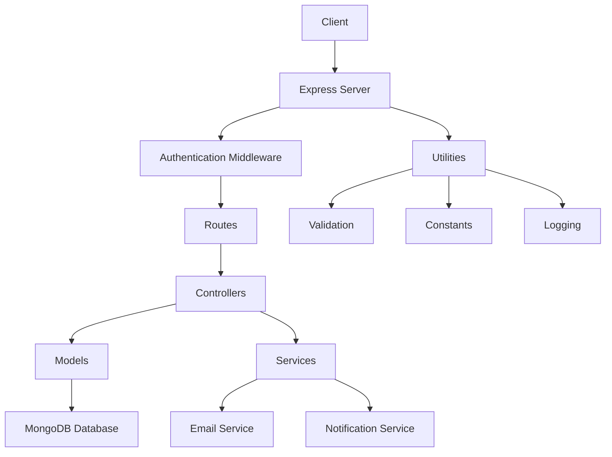

# 🚗  Rent a wheel - Vehicle Rental Management System

A full-featured vehicle rental management system built with **React.js**, **Node.js**, and **MongoDB**.  
Easily browse, book, and manage rental cars with a modern, responsive interface and secure backend.

## 📸 Screenshots

### Home Page


---

## ✨ Features

- 🔒 **Authentication** (JWT)
- 🚙 **Browse Cars**
- 📅 **Book a Car**
- 🕑 **Booking History**
- 💳 **Payments**
- 📧 **Contact Us**
- 📱 **Responsive Design**
- 🛠️ **Admin Panel** (optional)

---

## 🛠️ Tech Stack

- ⚛️ React.js
- 🟩 Node.js & Express
- 🍃 MongoDB
- 💌 Nodemailer / EmailJS

---

## 🖼️ System Overview


```md
## 🖼️ System Overview

User 👤
   │
   ▼
Frontend (React.js) 🚗
   │
   ▼
Backend (Node.js/Express) 🟩
   │
   ├──> MongoDB 🍃
   └──> Email Service 💌
```

## 🗂️ Project Structure

```
/client              # React frontend
  /public             # Public files
  /src                # Source files
    /components       # React components
    /pages            # Page components
    /styles           # CSS styles
    App.js            # Main app component
    index.js         # Entry point

/server              # Node.js backend
  /config             # Configuration files
  /controllers        # Request handlers
  /middleware         # Middleware functions
  /models             # Database models
  /routes             # API routes
  /utils              # Utility functions
  server.js           # Entry point
```

---

## Project Architecture

This project is following the **Client server Architecture**

### Architectural Diagram



## 📚 API Documentation

### Authentication
- `POST /api/auth/register`: Register a new user
- `POST /api/auth/login`: Login a user

### Users
- `GET /api/users`: Get all users (Admin)
- `GET /api/users/:id`: Get user by ID (Admin)
- `PUT /api/users/:id`: Update user by ID (Admin)
- `DELETE /api/users/:id`: Delete user by ID (Admin)

### Vehicles
- `GET /api/vehicles`: Get all vehicles
- `GET /api/vehicles/:id`: Get vehicle by ID
- `POST /api/vehicles`: Add a new vehicle (Admin)
- `PUT /api/vehicles/:id`: Update vehicle by ID (Admin)
- `DELETE /api/vehicles/:id`: Delete vehicle by ID (Admin)

### Bookings
- `GET /api/bookings`: Get all bookings
- `GET /api/bookings/:id`: Get booking by ID
- `POST /api/bookings`: Create a new booking
- `PUT /api/bookings/:id`: Update booking by ID
- `DELETE /api/bookings/:id`: Cancel booking by ID

### Payments
- `GET /api/payments`: Get all payments
- `GET /api/payments/:id`: Get payment by ID
- `POST /api/payments`: Process a new payment

### Reviews
- `GET /api/reviews`: Get all reviews
- `GET /api/reviews/:id`: Get review by ID
- `POST /api/reviews`: Add a new review
- `PUT /api/reviews/:id`: Update review by ID
- `DELETE /api/reviews/:id`: Delete review by ID

---

## 🚀 Getting Started

### 1. **Clone the Repository**

```bash
git clone https://github.com/MuhammadQasimTasleem/car-rental-service.git
cd car-rental-service
cd backEnd
npm install
```

### 2. **Set Up Environment Variables**

Create a `.env` file in the `/server` directory and add the following:

```
PORT=5000
MONGO_URI=mongodb://localhost:27017/car-rental
JWT_SECRET=your_jwt_secret
EMAIL_USER=your_email@gmail.com
EMAIL_PASS=your_email_app_password
```
start the backend server
```bash
npm run dev
```
### 3. **Frontend setup**
```bash
cd ../Frontend
npm install
npm start
```
###  **👨‍💻 Contributing**
1.Fork the repository
2.Create a feature branch (git 3.checkout -b feature/your-feature)
4.Commit your changes (git commit -m 'Add feature')
5.Push to your branch (git push origin feature/your-feature)
6.Open a Pull Request
###  **Security & Best Practices**

Passwords are hashed before storage
JWT authentication for protected routes
Input validation on both frontend and backend
Centralized error handling
Environment variables for sensitive data


###  **License**
This project is licensed under the MIT License.


##  🙏 Acknowledgements

React.js
Node.js
MongoDB
Bootstrap
Nodemailer
EmailJS

---


